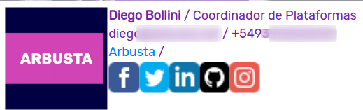

# Generador de firmas para correo electrónico

Desarrollado por Arbusters en 2018, reversionado con nueva imagen de marca en julio de 2019 por ARB|LAB.

Básicamente funciona así,

y la firma se ve así:

